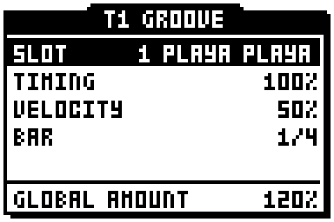
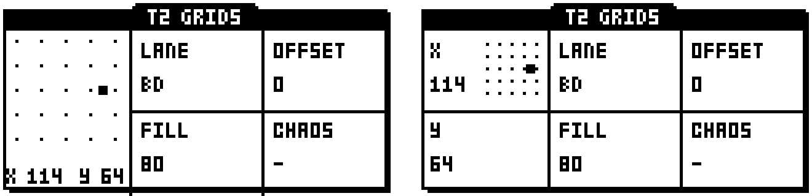
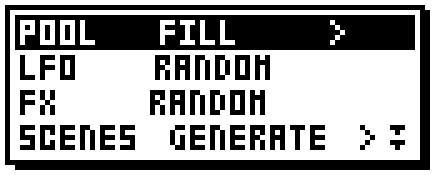

# octalab

Creative helper functions for the **Elektron Octatrack**, added to the stock
**OS 1.40C** — built and tested on an Octatrack MKI.

octalab works with **feel and randomisation as sources of inspiration** — the
way the groove pool, MIDI tools and generators of a DAW like Ableton Live hand
you a feel or a variation to react to: a starting point you would not have
chosen, applied in one gesture, then yours to keep, edit or throw away. It
also adds **shortcuts to the stock workflow**. It adds **no new effects and no
new synthesis**; other projects already cover that ground.

## No code here, for now

This repository publishes no firmware, no build, no flashing procedure — and,
for now, **no source code**. octalab changes too fast to be worth reading yet:
new builds reach the unit almost every day, pages are redesigned after each
test, and whole directions are tried and dropped (see *Tried and parked*
below). The code will be published when the functions settle, as a module of
octabam's remixer (below).

What is here: what octalab does and where it is going, and what was learned
about the firmware on the way.

---

## In active development: grooves — with your own groove files

**The main piece of work right now** is a groove page after the **groove pool
of Ableton Live**: a groove — the timing and the dynamics of a real
performance — laid onto the trigs you already placed, so that a straight
pattern takes the feel of a drummer.

*The GROOVE page, drawn by the Octatrack's own firmware (captured in an
emulator): track 1 plays a groove extracted in Live, full timing, 35 % of its
dynamics, the whole pattern's feel pushed to 120 %.*

### Grooves are files, and you can add your own

- **A folder `GROOVES` at the root of the CF card** holds the grooves, one
  small file each (`.otg`, a few hundred bytes). The page lists whatever is
  there, sorted by name: **add a file, and it is in the list** the next time
  you open the page.
- **They are made from Ableton Live groove files (`.agr`)** — any groove your
  Live has in its Groove Pool, including the ones you extract yourself from
  your own loops and recordings with *Extract Groove*. A small converter on
  the computer turns a folder of `.agr` files into `.otg` files, ready to copy
  to the card. It reads what Live writes (compressed or not), keeps up to
  **four bars (64 steps)**, and brings along the amounts Live suggests.
- **It recognises how the groove is played**: straight 16ths, swung 8ths, or a
  triplet (shuffle) feel — a shuffle groove pulls straight 16th trigs onto the
  triplet. Loose, "late" grooves keep their looseness: when a groove has two
  hits in one 16th, the one nearest the grid is kept.
- **No groove data comes with octalab.** Your grooves stay yours; the
  converter will be published with the rest of octalab. MIDI files (a
  drummer's loop) are the next source planned.
- **Nothing depends on the file afterwards.** A printed groove is ordinary
  trig data: remove a file from the card, and your projects do not notice.

### What it does to the pattern

It uses the Octatrack's own sequencer — no new engine:

- **timing → micro timing**: each trig is moved as the groove plays that step,
  in the sequencer's own steps of 1/384 of a bar, up to almost a full step
  early or late;
- **dynamics → volume p-locks** (AMP VOL) on the trigs; a volume lock you had
  set by hand is scaled, not replaced;
- once kept, **they are ordinary trigs and locks**: edit them by hand, tighten
  them with the stock quantize of TRACK TRIG EDIT, save them with the project.
  The track's own swing setting is not touched.

### The page

In grid recording, **[DOWN]** walks from the grid to a new layer of pages under
it, the **GRID PAGES** — GROOVE is the first — and **[UP]** walks back.

- **Each track has its own groove** — OFF until you choose one, so a track you
  do not touch stays exactly as it was — and its own amounts, after Live's:
  **TIMING** (how far the trigs move toward the groove), **VELOCITY** (how
  much of its dynamics), **QUANTIZE** (how much of your own played timing is
  removed first), **BAR** (which bar of a longer groove your pattern starts
  on, shown as `2/4`).
- **One AMOUNT for the whole pattern** (Live's *Global Amount*), up to 200 %,
  pushes or calms the feel of every grooved track at once.
- **You hear it as you turn**: every value is written at once, on the track
  you see, AMOUNT on all of them. Changes always start from the trigs as they
  were before the groove, so you can come back later and dial a feel down.
- **[ENTER] keeps it, [EXIT] puts the pattern back** as it was when the page
  opened. You can keep placing trigs while the page is open; they take the
  groove at once.

**State:** on the unit (MKI) since 13 Sep 2026, and working. First version:
audio tracks, pattern scale 1X; the per-track settings are kept until
power-off (the printed feel stays with the project). The volume locks play
but the stock display does not show them yet. The page and its settings are
still changing with each test.

## On hold : a Grids-style generator
For a week octalab carried a trig generator inspired by Mutable Instruments'
**Grids** ("topographic drum sequencer"): a map of rhythms explored with two
encoders, a fill amount per track, the trigs printed as you turned. It ran on
the unit — and in use it brought little to making music on the Octatrack. It
is put aside; the code stays in the workshop in case someone has the idea
that makes it worth it. **Generation itself goes on** (see *Where it is
going*): what was parked is this one generator, not the idea.

*Left: the last GRIDS page as the unit drew it. Right: a rough mock-up of what
it would have become (not polished — the concept was parked first).*

## Part of octabam's remixer

octalab is built as a **module of [octabam](https://github.com/sambanks/octabam)'s
remixer**, the project that composes the community's Octatrack modifications
into one image built from the user's own 1.40C. octalab is a ColdFire DRAM
module — its code lives in octabam's memory reserve, loaded at boot by
octabam's loader — and it touches the OS in only a handful of places, each
declared to the remixer so that it can refuse a collision with another
module. It runs on an Octatrack MKI through octabam's loader (first flash
11 Sep 2026, in daily use since), and it builds and boots beside
ems-octakit's Kits under octabam's emulator.

**The functions are not available to the public yet.** They will be offered
through octabam's remixer when they settle.

## The octalab menu: double-tap [FUNCTION]

Everything octalab adds as a one-gesture function is in one list. **Tap
[FUNCTION] twice, quickly**, from almost any screen, and the list opens over
whatever you were doing.

It has one row per subject — the sample pool, the LFOs, the effects, the
scenes, the trigs, the track — and each row shows one action:

- **LEVEL** (or the up/down arrows) moves between rows;
- **[LEFT] / [RIGHT]** choose the row's action (`>` shows there is more);
- **[ENTER]**, or **pressing LEVEL**, runs it; **[EXIT]** closes the list.

An action that erases asks first (YES/NO). [FUNCTION] alone, or held with
another key, still does what it always did. Some functions have options, in
**OCTALAB**, a fifth category of the MAIN MENU (`[FUNCTION] + [MIXER]`).

## Functions

✅ = used on the unit and working, changes kept across a power cycle.

| function | what it does | |
|---|---|---|
| **pool** | | |
| `FILL POOL` | fills every empty STATIC sample slot with random audio found anywhere in the set's `AUDIO` folder | ✅ |
| `SHUFFLE POOL` | re-deals the loaded samples among the slots they occupy | ✅ |
| `CLEAR POOL` | empties every sample slot, after a YES/NO | ✅ |
| **LFO** | | |
| `RANDOM LFO` | randomises the current track's LFOs, including what they modulate and their waveforms | ✅ |
| **FX** | | |
| `RANDOM FX` | chooses random effects for the current track | ✅ |
| **scenes** | | |
| `GENERATE SCENES` | fills scenes 2 to 16 with random locks, the OCTALAB options choosing which pages; **scene 1 stays blank**, so a clean scene is always there | ✅ |
| `CLEAR SCENES` | empties all sixteen scenes, after a YES/NO | ✅ |
| **trigs** | | |
| `RANDOM P-LOCKS` | gives every normal (red) trig of the current track a random parameter lock for each parameter ticked in the options, inside its own range | ✅ |
| `RANDOM SMP LOCKS` | gives every normal (red) trig of the current track a sample lock to a random sample from the pool | ✅ |
| `CLEAR P-LOCKS` | removes every parameter lock of the current track in the current pattern; trigs and sample locks stay | ✅ |
| `CLEAR SMP LOCKS` | removes every sample lock of the current track in the current pattern | ✅ |
| **track** | | |
| `INIT TRACK` | puts the current track back the way a new project starts it, trigs kept — a clean sound under the same sequence | ✅ |

## UI workflow improvements

| function | shortcut | what it does | |
|---|---|---|---|
| **Quick access to the sample edit window on MK1** | **[TRIG] + [BANK]** (grid recording) | opens the **audio editor on the sample locked on that trig** — or on the sample the track's machine plays (STATIC and FLEX); the trig stays as it was. [BANK] alone works as before | ✅ |
| **GRID PAGES** | **[DOWN] / [UP]** (grid recording, no trig held) | pages under the grid for entering and shaping trigs; GROOVE is the first | 🚧 |

## Where it is going

- **Grooves**: the volume locks shown on the trigs like any lock; every
  pattern scale, not only 1X; the settings kept with the project instead of
  until power-off; MIDI files as a source; Live's RANDOM, as far as the
  sequencer allows; then trig probability and trig count in the same spirit —
  native features, given an interface that makes them playable.
- **Generation, still**: work on generating trigs goes on beside the grooves
  — euclidean rhythms, densities, trigless locks spread over a share of the
  steps (a first version ran on the unit), each on a page where the result
  shows as you turn.
- **More pages on GRID PAGES** for entering and shaping trigs.
- **Controlled randomness** — variations around the current values rather
  than a fresh draw.
- **More workflow shortcuts** in the spirit of [TRIG] + [BANK].
- **Undo** for octalab's functions.

## State of the project

- **Machines:** built and tested on an Octatrack MKI running OS 1.40C. The
  MKII runs the same OS image, so octalab should work there as well — not
  tested yet. No other OS version.
- **No build is distributed**, now or later: an image contains Elektron's OS.
  When the module is published, it will be built by each user from their own
  stock OS through octabam's remixer.

## For other firmware projects

The reverse-engineering findings behind these functions — addresses, data
layouts, the traps that cost a failed build, each with its confidence level
and the image it was read from — are in **[`docs/FINDINGS.md`](docs/FINDINGS.md)**.

octalab is an independent workshop, not a fork. It reads
[octamax](https://github.com/mxldyn/octamax),
[octabam](https://github.com/sambanks/octabam),
[ems-octakit](https://github.com/emuyia/ems-octakit) and
[octa-bt-pt](https://github.com/bryantysinger/octa-bt-pt) as reference, and
publishes only what they still mark open.

---

**MIT licensed** (this repository's text and images). These findings came from
reading other people's work; nothing here is fenced off.

*Independent, unofficial, educational. Not endorsed by, supported by, or
affiliated with Elektron. "Elektron" and "Octatrack" are trademarks of Elektron
Music Machines MAV AB, used here only to identify the hardware under study.
"Ableton" and "Live" are trademarks of Ableton AG; "Grids" is a module by
Mutable Instruments.*
