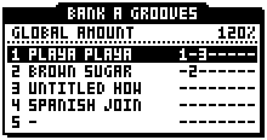
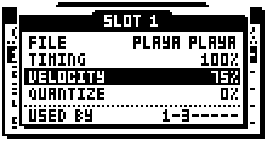
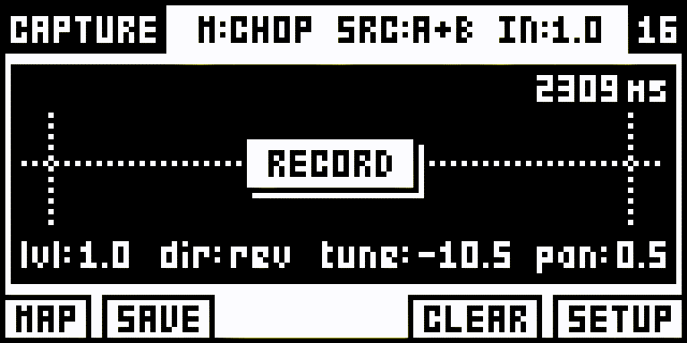
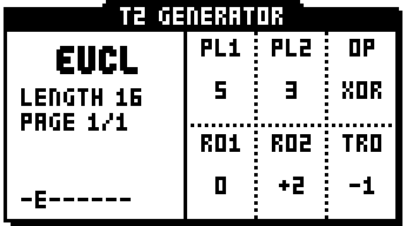

# octalab

Creative helper functions for the **Elektron Octatrack**, added to the stock
**OS 1.40C** — built and tested on an Octatrack MKI.

octalab works with **feel and randomisation as sources of inspiration** — the
way the groove pool, MIDI tools and generators of a DAW like Ableton Live hand
you a feel or a variation to react to: a starting point you would not have
chosen, applied in one gesture, then yours to keep, edit or throw away. It
also adds **shortcuts to the stock workflow**. It adds **no new effects and no
new synthesis**; other projects already cover that ground.

## Contents

- [Grooves](#grooves)
- [CAPTURE](#capture)
- [GENERATOR](#generator)
- [Octalab menu](#octalab-menu)

## An exploration, not a product

octalab is a **workshop exploring what can be added to the Octatrack's own
firmware** — what the sequencer and the pages will accept, and what is worth
having once it runs on the unit. It is not a finished set of features on its
way to a release: new builds reach the unit often, and pages are redesigned
after each test. Some functions may settle and be shared as a module of
octabam's remixer (below); others will stay experiments.

This repository publishes no firmware, no build, no flashing procedure — and,
for now, **no source code**: it moves too fast to be worth reading yet. What is
here: what octalab explores, what came out of it, and what was learned about
the firmware on the way.

---

## Grooves

The first direction octalab explores is a groove workflow after the **groove
pool of Ableton Live**: a groove — the timing and the dynamics of a real
performance — laid onto the trigs you already placed, so that a straight
pattern takes the feel of a drummer. Each bank has a **groove pool of eight
slots**, like the Octatrack's own sample slots, and each track takes its
feel from one of them.

*The groove pool of bank A, drawn by the Octatrack's own firmware (captured
in an emulator): slot 1 plays a groove extracted in Live and drives tracks 1
and 3, slot 2 drives track 2; the bank's feel is pushed to 120 %.*

### Grooves are files, and you can add your own

- **A folder `GROOVES` at the root of the CF card** holds the grooves, one
  small file each (`.otg`, a few hundred bytes). The pages list whatever is
  there, sorted by name: **add a file, and it is in the list** the next time
  you open them.
- **They are made from Ableton Live groove files (`.agr`)** — any groove your
  Live has in its Groove Pool, including the ones you extract yourself from
  your own loops and recordings with *Extract Groove*. A small converter on
  the computer turns a folder of `.agr` files into `.otg` files, ready to copy
  to the card. It reads what Live writes (compressed or not), keeps up to
  **four bars (64 steps)**, and brings along the amounts Live suggests.
- **It recognises how the groove is played**: straight 16ths, swung 8ths, or a
  triplet (shuffle) feel — a shuffle groove pulls straight 16th trigs onto the
  triplet. Loose, "late" grooves keep their looseness: when a groove has two
  hits in one 16th, the one nearest the grid is kept.
- **No groove data comes with octalab.** Your grooves stay yours; the
  converter will be published with the rest of octalab. MIDI files (a
  drummer's loop) are the next source planned.
- **Nothing depends on the file afterwards.** A printed groove is ordinary
  trig data: remove a file from the card, and your projects do not notice.

### What it does to the pattern

It uses the Octatrack's own sequencer — no new engine:

- **timing → micro timing**: each trig is moved as the groove plays that step,
  in the sequencer's own steps of 1/384 of a bar, up to almost a full step
  early or late;
- **dynamics → volume p-locks** (AMP VOL) on the trigs; a volume lock you had
  set by hand is scaled, not replaced;
- once kept, **they are ordinary trigs and locks**: edit them by hand, tighten
  them with the stock quantize of TRACK TRIG EDIT, save them with the project.
  The track's own swing setting is not touched.

### The groove pool: eight slots per bank

- **[BANK] + [ENTER]** opens the pool of the current bank from almost
  anywhere ([BANK] held or tapped — [ENTER] did nothing on the bank prompt);
  **[BANK]** opens it from a track's GROOVE page.
- **LEVEL chooses a slot's groove file.** Beside each slot, the tracks of the
  pattern that use it (`1-3-----`). On the selected slot a long name
  scrolls, as in the stock sample slot list.
- **Change a slot, and every track on it follows at once** — in every pattern
  of the bank. One slot can drive the kick, the snare and the hats together:
  change the groove once, the whole kit moves.
- **[ENTER] opens a slot's settings**, after Live's: **TIMING** (how far the
  trigs move toward the groove), **VELOCITY** (how much of its dynamics),
  **QUANTIZE** (how much of your own played timing is removed first), and
  which tracks use it. An empty slot shows `-`.
- **GLOBAL AMOUNT** (Live's *Global Amount*), at the top of the pool and on
  **encoder A**: pushes or calms the feel of every grooved track of the bank,
  up to 200 %.
- **Immediate, like the sample slots**: every change is printed as you turn.

### The track's GROOVE page

In grid recording, **[DOWN]** walks from the grid to the **GRID PAGES**: GROOVE
under the grid, and **[UP]** to [GENERATOR](#generator) above it.

- **SLOT**: OFF until you choose one — a track you do not touch stays exactly
  as it was — or one of the bank's eight slots.
- **TIMING** and **VELOCITY**: this track's **share** of the slot's amounts
  (100 % = all of it) — the hats can take half the dynamics the snare takes
  from the same groove. **BAR**: which bar of a longer groove the pattern
  starts on (`2/4`). **GLOBAL AMOUNT** on encoder A, from any row.
- **You hear it as you turn**, and you can keep placing trigs while the page
  is open: they take the groove at once. Changes always start from the trigs
  as they were before the groove, so a feel can be dialled down or taken off
  later (SLOT back to OFF).
- **[ENTER] on the SLOT row opens the bank's pool on the track's slot** — to
  give an empty slot its groove file at once. Elsewhere [ENTER], like
  **[EXIT]** and **[UP]** on the first row, closes the page and keeps
  everything: there is nothing to confirm, a groove always starts from the
  trigs as they were, and SLOT back to OFF gives the track back exactly.
  **[REC]** leaves the page and grid recording in one press. Held arrows
  scroll the rows.

**State:** on the unit (MKI) since 13 Sep 2026; the groove pool since 14 Sep;
the groove map and the groove following new trigs since 15 Sep — working.
First version: audio tracks, pattern scale 1X.

### The groove map: kept with the project

The pools and the tracks' settings are kept with the project, in a small file
of octalab's own in the project's folder (`octalab_grooves.map`): each bank's
pool, every track's slot and shares, and the trigs as they were before their
groove — so a groove can still be dialled down or taken off after a power
cycle. The Octatrack's own project files are not touched: a project stays
readable by a stock OS.

- **Read back** the first time a groove page opens after a boot or a project
  change (the printed feel is already in the patterns; the map is only needed
  to edit).
- **Written by the Octatrack's own storage task**, as the stock writes its
  banks: a moment after the sequencer stops, and at every sync — nothing to
  save by hand.
- **A trig that appears on a grooved track** — placed by hand, recorded live
  or pasted — takes its groove by itself. `PRINT GROOVE` (octalab menu)
  prints the bank's grooves again, hand edits on grooved trigs included.

Next: **pool presets**: eight grooves and their settings saved under a name
and loaded into any bank, from **[LEFT]** on the pool page.

### Open questions

- **The last change before a power-off.** With the groove map, a change
  reaches the card when the sequencer has stopped for a moment, or at a sync;
  switching off right after a change, playing, would lose that change's
  settings (never the printed trigs). The stock banks behave alike: the
  current bank reaches the card at SYNC / SAVE / project change.
- **Copying a project.** What the Octatrack does with a file of ours in a
  project folder on SAVE AS or a project copy is still to check: the map may
  stay behind.
- **Pattern scale.** Only 1X for now. At 3/4 a groove printed at 1X is still
  felt: the micro timing seems to follow the step — to confirm before other
  scales are allowed.
- **MKII**: the same OS image; untested.

## CAPTURE

CAPTURE is both a **sampling notepad and a creative tool**: it makes it quick
to turn sounds into a playable kit of individual samples or a sliced sample
chain. It borrows the selected track's recorder, captures external inputs or
a track's audio onto trig-key pads, and lets you play and shape the results
right away. Three ways to use it:

- **TRIG-key sampling (HOLD mode):** arm recording, press an empty trig pad to
  capture a sound, and release it to stop. The filled pad plays the sound back
  immediately — a quick, Koala-style way to build a set of samples on the fly.
- **CHOP:** start one continuous recording from a playing source. Press the
  next empty trig pad where you want a cut: the piece just recorded becomes a
  pad, and recording continues into the next one. This turns a longer sample
  into playable slices as you listen.
- **DICT:** set a level threshold and arm a pad. Recording starts when a sound
  crosses it and stops automatically after the sound falls quiet, suited to
  collecting individual hits and short transients.

Trim and shape the pads, then save the kit as individual WAVs and the sample
chain as one WAV with slice markers in its `.ot` file. An optional slot chooser
loads the chain through the Octatrack's own storage path.

**MAP brings a sketch into the sequencer.** Select one or several track keys,
then confirm: CAPTURE saves the sample chain if needed and loads it into each
selected track's own STATIC or FLEX slot in one operation. The tracks keep
their machine and playback settings while the new chain becomes available to
them. The planned single-pad gesture will send one recorded pad as a whole
sample to the chosen tracks; that path is not in the hardware-tested build yet.

*CAPTURE UI mock-up, enlarged 6× from the original 128 × 64 pixel design.
This is a software mock-up, not a photograph of the unit.*

**CAPTURE has been tested on an Octatrack MKI**: recording, pad playback and
editing, saving real audio, slot assignment and the REC arm and
overwrite confirmation have run on the unit. The [firmware findings](docs/FINDINGS.md)
record what CAPTURE taught us about the stock recorder and save jobs.

## GENERATOR

The GRID PAGE **above** the grid (**[UP]** in grid recording): a generator per
track that adds a rhythm to the trigs you placed — your trigs stay where they
are, the generator only fills the other steps. Its first mode is
**euclidean**, after the euclidean mode of Elektron's Digitakt II: two
generators spread their pulses as evenly as possible over the track's length,
each with its own rotation, combined by a boolean operator, and the result
rotated again.

*The GENERATOR page, drawn by the Octatrack's own firmware (captured in an
emulator), in the stock look of the pages where the six encoders work (EFFECT
SETUP, LFO SETUP): track 2 in EUCL — 5 pulses XOR 3 pulses rotated +2, the
whole rotated −1; only track 2 has a generator (`-E------`).*

- **LEVEL chooses the mode** (OFF, EUCL — more may come), shown large on the
  left with the track's LENGTH and the step PAGE the trig keys show; at the
  bottom, each track's mode letter.
- **The six encoders, where the cells are**: A PL1 · B PL2 (pulses, up to the
  length) · C OP (OR, XOR, AND, SUB) / D R01 · E R02 (the two rotations) ·
  F TRO (the result's rotation). The trigs appear on the trig keys as you
  turn.
- **Your trigs are never moved.** Press a generated trig, or give it a
  parameter or a sample lock, and it becomes yours: it stays, whatever the
  generator does next. Trig keys, copy and paste, locks with a trig held work
  as usual on the page.
- **The track's length is the generator's** — normal or per-track scale; a
  length changed in the SCALE menu makes the rhythm again.
- **Leaving never asks**: [ENTER], [EXIT], [DOWN] close the page, everything
  stays live; [REC] also leaves grid recording. **LEVEL back to OFF** takes a
  track's generated trigs away (a YES/NO first when it has settings).
  **[FUNCTION] held + LEVEL down prints** the track — its trigs stay as
  ordinary trigs, the generator is forgotten (the Digitakt's [FUNC] + EUC
  off); `PRINT EUCLID` in the octalab menu does it for the whole bank.
- **CLEAR, then undo**: after the stock CLEAR TRIGS or CLEAR PATTERN a
  generator sleeps; the stock undo brings its trigs back and wakes it.
- **Kept with the project**, in a small file of octalab's own beside the
  groove map (`octalab_generators.map`), written and read with it.

**State:** on the unit (MKI) since 15 Sep 2026, working — five builds that day,
each after a test on the unit. Audio tracks.

**Coming soon:** GRIDS will have its own page in the GRID REC PAGES.

## Part of octabam's remixer

octalab is built as a **module of [octabam](https://github.com/sambanks/octabam)'s
remixer**, the project that composes the community's Octatrack modifications
into one image built from the user's own 1.40C. octalab is a ColdFire DRAM
module — its code lives in octabam's memory reserve, loaded at boot by
octabam's loader — and it touches the OS in only a handful of places, each
declared to the remixer so that it can refuse a collision with another
module. It runs on an Octatrack MKI through octabam's loader (first flash
11 Sep 2026, in daily use since), and it builds and boots beside
ems-octakit's Kits under octabam's emulator.

**The functions are not available to the public.** Those that settle may be
offered through octabam's remixer one day; nothing here is a promise of a
release.

## Octalab menu

Everything octalab adds as a one-gesture function is in one list. **Tap
[FUNCTION] twice, quickly**, from almost any screen, and the list opens over
whatever you were doing.

**The screen below shows V1**, tested on an Octatrack MKI.

It has one row per subject — the sample pool, the LFOs, the effects, the
scenes, the trigs, the grooves, the generators, the track — and each row
shows one action:

- **LEVEL** (or the up/down arrows) moves between rows;
- **[LEFT] / [RIGHT]** choose the row's action (`>` shows there is more);
- **[ENTER]**, or **pressing LEVEL**, runs it; **[EXIT]** closes the list.

An action that erases asks first (YES/NO). [FUNCTION] alone, or held with
another key, still does what it always did. Some functions have options, in
**OCTALAB**, a fifth category of the MAIN MENU (`[FUNCTION] + [MIXER]`).

### Menu V2: UI work in progress

V2 is the next project. These are early software mock-ups for its new UI,
enlarged 4× from the 128 × 64 pixel designs; they are not firmware screenshots.

## Functions

✅ = used on the unit and working, changes kept across a power cycle.

| function | what it does | |
|---|---|---|
| **pool** | | |
| `FILL POOL` | fills every empty STATIC sample slot with random audio found anywhere in the set's `AUDIO` folder | ✅ |
| `SHUFFLE POOL` | re-deals the loaded samples among the slots they occupy | ✅ |
| `CLEAR POOL` | empties every sample slot, after a YES/NO | ✅ |
| **LFO** | | |
| `RANDOM LFO` | randomises the current track's LFOs, including what they modulate and their waveforms | ✅ |
| **FX** | | |
| `RANDOM FX` | chooses random effects for the current track | ✅ |
| **scenes** | | |
| `GENERATE SCENES` | fills scenes 2 to 16 with random locks, the OCTALAB options choosing which pages; **scene 1 stays blank**, so a clean scene is always there | ✅ |
| `CLEAR SCENES` | empties all sixteen scenes, after a YES/NO | ✅ |
| **trigs** | | |
| `RANDOM P-LOCKS` | gives every normal (red) trig of the current track a random parameter lock for each parameter ticked in the options, inside its own range | ✅ |
| `RANDOM SMP LOCKS` | gives every normal (red) trig of the current track a sample lock to a random sample from the pool | ✅ |
| `CLEAR P-LOCKS` | removes every parameter lock of the current track in the current pattern; trigs and sample locks stay | ✅ |
| `CLEAR SMP LOCKS` | removes every sample lock of the current track in the current pattern | ✅ |
| **groove** | | |
| `PRINT GROOVE` | prints the current bank's grooves again, from each track's trigs as they were before its groove — hand edits on grooved trigs go back to the groove | ✅ |
| **euclid** | | |
| `PRINT EUCLID` | makes every generated trig of the current bank an ordinary trig and forgets the bank's generators | 🚧 |
| **track** | | |
| `INIT TRACK` | puts the current track back the way a new project starts it, trigs kept — a clean sound under the same sequence | ✅ |

## UI workflow improvements

| function | shortcut | what it does | |
|---|---|---|---|
| **Quick access to the sample edit window on MK1** | **[TRIG] + [BANK]** (grid recording) | opens the **audio editor on the sample locked on that trig** — or on the sample the track's machine plays (STATIC and FLEX); the trig stays as it was. [BANK] alone works as before | ✅ |
| **GRID PAGES** | **[DOWN] / [UP]** (grid recording, no trig held) | pages beside the grid for entering and shaping trigs: GROOVE under it, GENERATOR above it | ✅ |
| **Groove pool** | **[BANK] + [ENTER]** (anywhere), **[BANK]** (on a GROOVE page) | the current bank's eight groove slots; the bank prompt's [ENTER] did nothing | ✅ |

## What it may explore next

Directions, not a roadmap — each one is tried on the unit and kept only if it
earns its place.

- **Grooves**: pool presets; every pattern scale, not only 1X; MIDI files as
  a source; Live's RANDOM, as far as the sequencer allows; then trig
  probability and trig count in the same spirit — native features, given an
  interface that makes them playable.
- **Generation**: more GENERATOR modes; the native trig probability on
  generated trigs; MIDI tracks; the track's length set from the page;
  trigless locks spread over a share of the steps (a first version ran on
  the unit).
- **More GRID REC PAGES** for entering and shaping trigs.
- **Controlled randomness** — variations around the current values rather
  than a fresh draw.
- **More workflow shortcuts** in the spirit of [TRIG] + [BANK].
- **Undo** for octalab's functions.

## State of the project

- **Machines:** built and tested on an Octatrack MKI running OS 1.40C. The
  MKII runs the same OS image, so octalab should work there as well — not
  tested yet. No other OS version.
- **No build is distributed**, now or later: an image contains Elektron's OS.
  If the module is ever published, it will be built by each user from their own
  stock OS through octabam's remixer.

## For other firmware projects

The reverse-engineering findings behind these functions — addresses, data
layouts, the traps that cost a failed build, each with its confidence level
and the image it was read from — are in **[`docs/FINDINGS.md`](docs/FINDINGS.md)**.
A [short coverage response](docs/FIRMWARE_COVERAGE_RESPONSE.md) points to the
findings that partly answer gaps raised in another firmware review.

octalab is an independent workshop, not a fork. It reads
[octamax](https://github.com/mxldyn/octamax),
[octabam](https://github.com/sambanks/octabam),
[ems-octakit](https://github.com/emuyia/ems-octakit) and
[octa-bt-pt](https://github.com/bryantysinger/octa-bt-pt) as reference, and
publishes only what they still mark open.

---

**MIT licensed** (this repository's text and images). These findings came from
reading other people's work; nothing here is fenced off.

*Independent, unofficial, educational. Not endorsed by, supported by, or
affiliated with Elektron. "Elektron" and "Octatrack" are trademarks of Elektron
Music Machines MAV AB, used here only to identify the hardware under study.
"Ableton" and "Live" are trademarks of Ableton AG; "Grids" is a module by
Mutable Instruments.*
