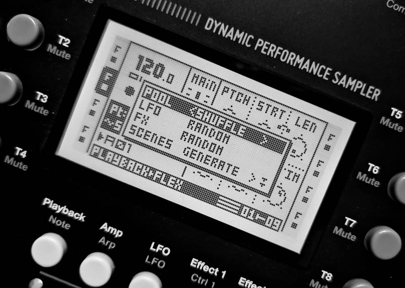
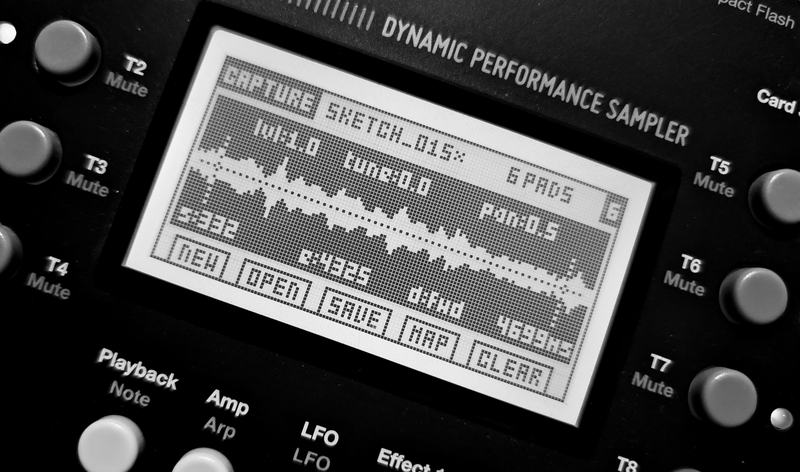
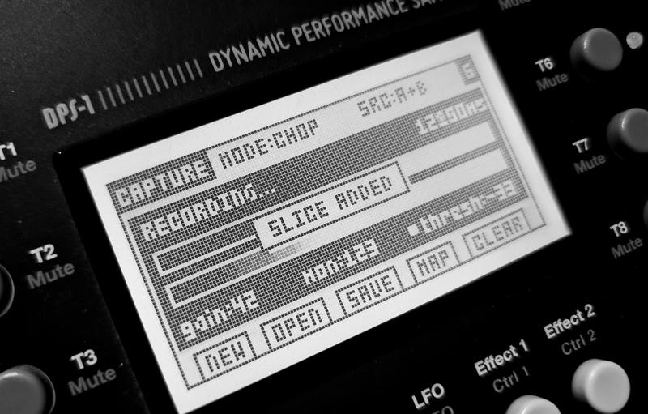
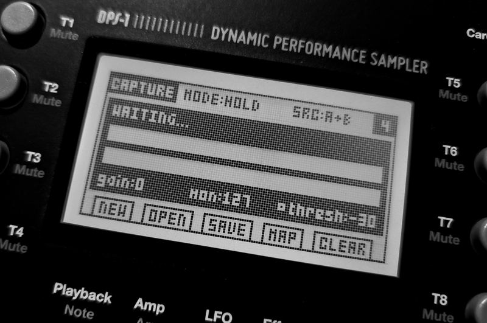
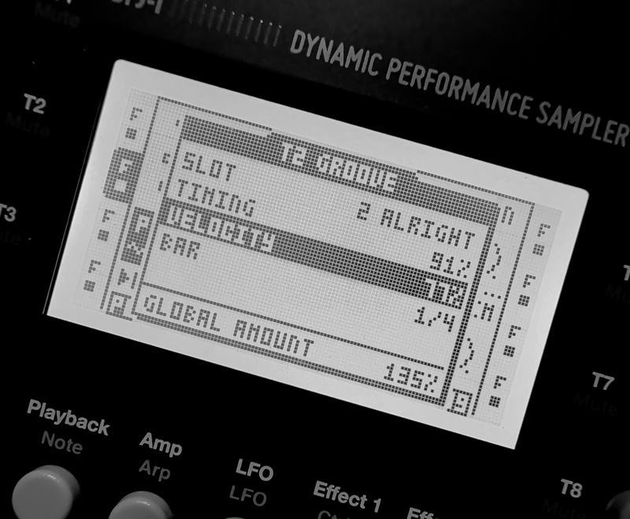
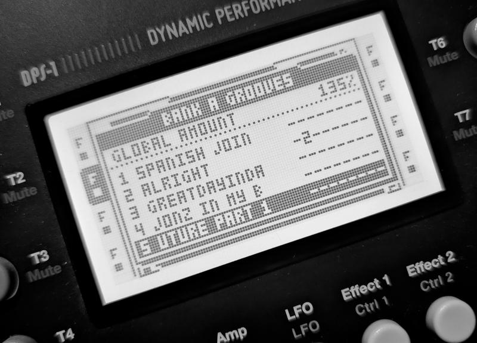
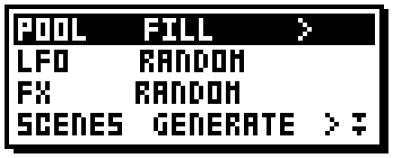
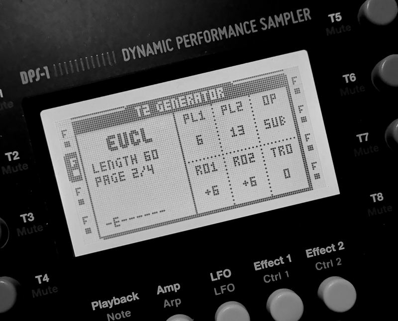

# octalab

```
             █           ▀█         █
▄▀▀▀▄ ▄▀▀▀▄ ▀█▀▀   ▀▀▀▄   █    ▀▀▀▄ █▀▀▀▄
█   █ █      █    ▄▀▀▀█   █   ▄▀▀▀█ █   █
▀▄▄▄▀ ▀▄▄▄▀  ▀▄▄▀ ▀▄▄▄█  ▄█▄  ▀▄▄▄█ █▄▄▄▀
```

`octalab │ ot explorations │ 2026`

For four weeks, octalab has explored what can be added to the Octatrack's native firmware, building on [octabam](https://github.com/sambanks/octabam) and other projects that paved the way for its reverse engineering and custom firmware ([octamax](https://github.com/mxldyn/octamax), [ems-octakit](https://github.com/emuyia/ems-octakit), [octa-bt-pt](https://github.com/bryantysinger/octa-bt-pt)). 

Initial additions included **Groove**, **Generators** (Euclidean sequencer, Grids), and a suite of randomization tools. The project is driven by a philosophy of collage and unpredictability to assist the creative process. The goal is to provide a starting point you wouldn't have naturally chosen, all in one gesture.

The project then focused on improving and streamlining the sampling workflow on the Octatrack. This first led to **Capture**, an instant sampler inspired by Koala Sampler, followed by **Tape**, a meta-recorder inspired by Norns.

Throughout development, a core principle was to avoid overcomplicating an instrument already known for its steep learning curve. The newly implemented shortcuts and pages integrate seamlessly into the Octatrack's legacy OS. Drawing inspiration from devices with state-of-the-art UX, such as Orthogonal Devices' ER-301, these additions naturally paved the way for a full-fledged interface project. This led to **ot1**: an independent custom firmware built upon octalab's technical and UX discoveries, centered around a brand-new scripting language developed specifically for the OT.




## Where octalab stands

| when | |
|---|---|
| early September 2026 | **Randomisation**: one-gesture functions that fill the sample pool, randomise LFOs, effects, scenes and locks |
| September, 2nd week | **GROOVE and the groove pool**, **Generators (Double trig Euclidean sequencer, MI Grids)**.
| September, 3rd week | **CAPTURE**, an instant sampler on the trig keys |
| end of September | **Direct to CF** and **TAPE**: recording straight to the card while the machine plays, a meta-recorder that keeps everything you play, and independent playback beside the eight tracks |
| October | **OType** scripting language for OT and **ot1** cfw.|


### A quick note on OT1 and OType

The workflow and screen changes octalab explored are too many to fit as one
more module in a remix. They are heading into
**[ot1](https://github.com/nordseele/ot1)**, an independent custom firmware:
fixed rather than remixed, and built around
**[OType](https://nordseele.github.io/otype-docs/)**, a small scripting
language in the spirit of monome Teletype, so that users can add their own
functions and shape ot1 to the way they work. A very personal project for
now, released once OType is mature.

Octalab itself stays a research laboratory, an "atelier/ workshop". Some features will be made available as modules compatible with Octabam. What can travel as an octabam module will, and octabam modules will run on ot1.

## What octalab has studied

Each section says what runs on the unit and what is still in test builds.
**No firmware, build or source code is published.**

### Direct to CF: recording to the card, and playing it back

**The largest piece of research so far.** The stock Octatrack records only
into its sample memory: a take is as long as the RAM allows and lives there
until you save it. octalab writes audio **straight to the CF card while the
machine plays**, and plays it back **on top of the eight tracks**.

- **Recording, on the MKI**: TAPE writes the master to a WAV file in the
  project folder during a session; CAPTURE saves its pads and chains to the
  card.
- **Playback, in test builds**: TAPE recordings play back from the card with cue points on
  the MKI; loading is still slow and some starts are refused while the card
  is busy.
- **A ninth voice, in the emulator**: a playback path mixed into MAIN without borrowing one
  of the eight tracks runs in the emulator, sample for sample against the
  stock output; it is next on the unit.
- **The hard part** is sharing the card and the audio engine: writing while
  the tracks stream from the card, without a freeze or a dropout. Every
  build is first played in an emulator against the stock machine, then on
  the MKI.

### CAPTURE

**A sampling notepad.** The idea here is to bring workflows inspired by MPC, Koala Sampler, OP-1 to Octatrack. Record sounds onto the trig keys, play them at once,
and turn the good ones into a kit or a sliced chain without leaving the
pattern. CAPTURE borrows the selected track's recorder and records from the
external inputs or from a track, from almost any screen. 





*CAPTURE on the unit: a pad's waveform, CHOP recording, HOLD waiting for the threshold.*


Three ways to fill the pads:

- **HOLD**: arm, then press an empty trig key to record and release it to
  stop. The pad plays back immediately, Koala-style.
- **CHOP**: one continuous recording from a playing source. Each press on the
  next empty pad cuts there: the piece just recorded becomes a pad and
  recording carries on into the next one.
- **DICT**: set a threshold and arm a pad. Recording starts when a sound
  crosses the threshold and stops once it falls quiet again, which suits
  single hits.

Then trim and shape the pads and **SAVE**: individual WAVs, plus one sample
chain whose slices are in its `.ot` file. **MAP** loads that chain into the
STATIC or FLEX slot of each selected track in one step, so the tracks keep
their machine and settings and get the new material.

**State:** recording, pad playback and editing, saving, slot assignment,
REC arm and the overwrite confirmation run on the MKI. Performance under
heavy load (resampling a busy project while writing to the card) is still
being worked on.

### TAPE


**A meta-recorder, like a cassette running in the background.** TAPE
records what the Octatrack plays (MAIN, or another stereo pair) to a WAV file
in the project folder, so a good moment is never lost to not having pressed
REC. The target is **four channels at once**: a stereo pair on tape while
CAPTURE records another pair, with no freeze and no dropout.

**State:** diagnostic test builds have recorded MAIN to the card on the MKI.
Reliable long recording while CAPTURE writes too is not reached yet. The TAPE
view does not exist yet.


### GROOVE and the groove pool

**After Ableton Live's groove pool.** A groove is
the timing and dynamics of a real performance, laid onto the trigs you already
placed, so that a straight pattern takes a drummer's feel.




**On the pattern**, it only uses the stock sequencer:

- the timing becomes **micro timing**, up to almost a step early or late;
- the dynamics become **volume p-locks**, and a volume lock you set by hand is
  scaled, not replaced;
- a groove always starts from the trigs as they were, so it can be dialled
  down or removed later (SLOT back to OFF). New trigs, placed or recorded
  live, take the groove by themselves.

**On the page:** **SLOT** (OFF, or one of the bank's eight), then the track's
**share** of the slot's TIMING and VELOCITY, so that the hats can take half of
what the snare takes from the same groove. **BAR** chooses which bar of a
longer groove the pattern starts on. You hear every change as you turn.

#### The groove pool

Each bank has **eight groove slots**, like the sample slots. It opens
from the bank prompt, with one gesture.



*Bank A's pool on the unit: five grooves loaded, the bank's feel pushed to
135 %.*

- **Change a slot and every track on it follows**, in every pattern of the
  bank: one groove change moves the whole kit.
- A slot's settings follow Live's: **TIMING**, **VELOCITY** and **QUANTIZE**
  (how much of your played timing is removed first). **GLOBAL AMOUNT** on
  encoder A pushes or calms every grooved track of the bank, up to 200 %.
- **Grooves are files.** A `GROOVES` folder at the root of the card holds them
  as `.otg` files, a few hundred bytes each. A small converter turns Ableton
  Live `.agr` grooves into `.otg`, including the ones you extract from your own
  loops. It keeps up to four bars and recognises straight, swung and triplet
  feels. **No groove data ships with octalab.**
- Pools and settings are kept with the project in a small file of octalab's
  own. The Octatrack's project files are not touched, and a project stays
  readable by a stock OS.

**Next:** pool presets, every pattern scale (only 1X for now), MIDI files as a
groove source.

### New workflows and new shortcuts

The Octatrack is famously full: a machine that takes time to learn and asks
you to know its manual by heart. octalab studied how shortcuts and a clearer
UX can make it more pleasant to use without breaking it: gestures that stay
natural for long-time users, placed where the stock machine had none, and
nothing that changes what an existing key already does.

- **A function menu**: one gesture opens a popup of one-gesture
  functions, grouped by subject: **POOL** (fill the free sample slots from the
  card, shuffle, clear), **LFO** and **FX** (random), **SCENES** (generate,
  clear), **TRIGS** (random parameter and sample locks, clear them),
  **TRACK** (init). Anything that erases asks YES/NO first.
- **From a trig to its sound**: in grid recording, a held trig opens the
  audio editor on its sample lock, or on the sample the track plays.
- **Every new page one gesture away**: CAPTURE, the groove pool and the
  grid pages open from wherever you are, and close without a question.



### Generators

A euclidean **generator** page, an exploration of Mutable Instruments'
**Grids**, non-destructive pattern **modifiers**, and a set of **views**
around the main screen. All these generators will now use Otype.  




## Additional notes

- **Machines:** built and tested on an Octatrack MKI running OS 1.40C. The
  MKII runs the same OS image but is untested.
- **Shared with octabam.** octalab runs as a module of octabam's remixer and
  has run on a MKI through octabam's loader daily since 11 Sep 2026. Its
  findings are written for octabam and the other community projects.
- **No build is distributed**, now or later: an image contains Elektron's OS.

## For other firmware projects

- **Findings**: addresses, data layouts and the traps that cost a failed
  build, each with its confidence level and source image, are in
  **[`docs/FINDINGS.md`](docs/FINDINGS.md)**. A
  [coverage response](docs/FIRMWARE_COVERAGE_RESPONSE.md) points to the ones
  that answer gaps raised in another firmware review.
- **Shared project settings**: the [OTX proposal](docs/OTX_PROJECT_PROPOSAL.md)
  and its [module guidelines](docs/OTX_MODULE_GUIDELINES.md) describe one
  per-project settings store shared by alternative firmwares. Unknown records
  survive a save unchanged. Not implemented yet.

---

© 2026 nordseele. This repository's text and images are licensed under
[CC BY-NC-SA 4.0](LICENSE): credit octalab, non-commercial use, share
adaptations alike. Versions published before 27 September 2026 were MIT.

*Independent, unofficial, educational. Not endorsed by, supported by, or
affiliated with Elektron. "Elektron" and "Octatrack" are trademarks of Elektron
Music Machines MAV AB, used here only to identify the hardware under study.
"Ableton" and "Live" are trademarks of Ableton AG. "Grids" is a module by
Mutable Instruments.*
