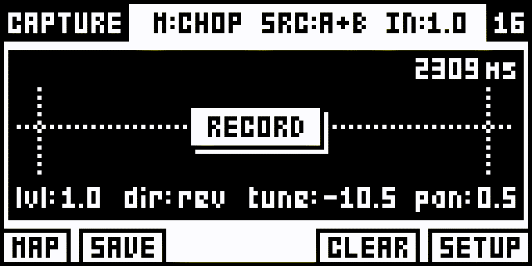
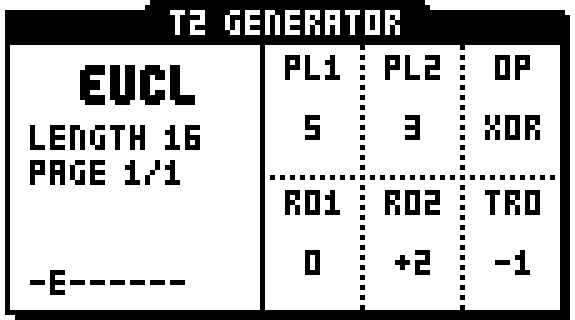
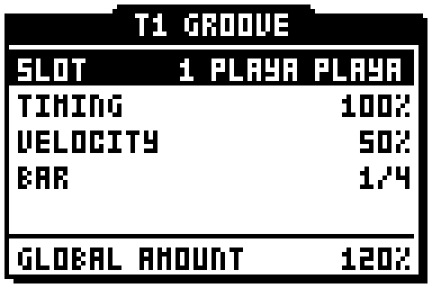
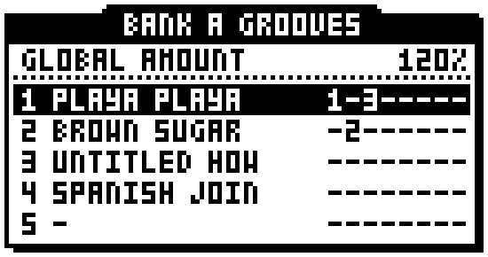

# octalab

Creative helpers and workflow shortcuts for the **Elektron Octatrack**, added
to the stock **OS 1.40C**. octalab is built and tested on an Octatrack MKI.

octalab treats **feel and randomness as sources of inspiration**, in the way
the groove pool, MIDI tools and generators of a DAW like Ableton Live offer a
feel or a variation to react to. You get a starting point you would not have
chosen, in one gesture, and it is yours to keep, edit or throw away. octalab
adds **no new effects and no new synthesis**; other projects cover that ground.

> **An exploration, not a product.** octalab is a workshop exploring what can
> be added to the Octatrack's own firmware. New builds reach the unit often and
> pages are redesigned after each test. **No firmware, build or source code is
> published**, and nothing here promises a release. Each feature is marked:
> ✅ on the unit and working · 🚧 in test builds · 💭 designed, not built.

## Contents

- [Getting around: VIEWS and GRID PAGES](#getting-around-views-and-grid-pages)
- [Shortcuts](#shortcuts)
- [VIEWS](#views): [CAPTURE](#capture) · [TAPE](#tape)
- [GRID PAGES](#grid-pages): [GENERATOR](#generator) · [GROOVE](#groove-and-the-groove-pool) · [MODIFIER](#modifier)
- [The octalab menu](#the-octalab-menu)
- [State of the project](#state-of-the-project)
- [For other firmware projects](#for-other-firmware-projects)

---

## Getting around: VIEWS and GRID PAGES

octalab's screens are arranged in two vertical stacks. You move through both
with the **[UP] / [DOWN]** arrows. The idea comes from the Orthogonal Devices
ER-301, whose small three-position MODE switch flips between its HOLD, EDIT
and SCOPE views. That module's interface is a reference for octalab's own
screens.

### VIEWS 🚧: the stack around the main screen

The stock main screen stays at the centre. [UP] and [DOWN] take you to
octalab's full-screen views and back.

```
            ┌───────────────────┐
            │     (future)      │   PERFORMANCE: pinned controls, one day
            └─────────▲─────────┘
                    [UP]
            ┌───────────────────┐
            │      CAPTURE      │   sampling notepad
            └─────────▲─────────┘
                    [UP]
  ══════════╡       MAIN        ╞══════════   the stock screens
                   [DOWN]
            ┌─────────▼─────────┐
            │       TAPE        │   meta-recorder
            └───────────────────┘
```

- **MAIN is home.** The stock Octatrack is untouched there; the arrows keep
  their stock meaning on every stock page that uses them.
- **Inside a view, [LEFT] / [RIGHT] may later page through that view's own
  modes.** The views would then form a small grid, and each screen would show
  a **minimap** of where you are:

```
  ┌──────────────────────────────┐
  │ CAPTURE · CHOP        ▫▪▫    │  ◂ minimap: row = view,
  │                       ▫▫▫    │           column = mode
  │                       ▫▫▫    │
  └──────────────────────────────┘
```

The order of the views and the minimap's look are being drawn now; the next
build reserves the view slots, empty ones included.

### GRID PAGES: the stack around grid recording

The same gesture already works in grid recording (✅ since 15 Sep 2026). With
no trig held, [UP] and [DOWN] leave the grid for pages that write or shape the
trigs:

```
            ┌───────────────────┐
            │     MODIFIER      │  💭 non-destructive changes
            └─────────▲─────────┘
                    [UP]
            ┌───────────────────┐
            │     GENERATOR     │  ✅ euclidean rhythms
            └─────────▲─────────┘
                    [UP]
  ══════════╡  GRID RECORDING   ╞══════════   the 16 trig keys
                   [DOWN]
            ┌─────────▼─────────┐
            │      GROOVE       │  ✅ feel from real playing
            └───────────────────┘
```

Every GRID PAGE follows the same rules:

- **Leaving never asks.** [ENTER], [EXIT] or the arrow back closes the page
  and keeps everything live. [REC] leaves the page and grid recording in one
  press.
- **You keep playing the grid.** Trig keys, copy/paste and locks with a trig
  held work as usual while a page is open.
- **Your own trigs come first.** A page adds to or reshapes the pattern and
  can always be dialled back to where you started.

## Shortcuts

| gesture | where | what it does | |
|---|---|---|---|
| **[FUNCTION] twice, quickly** | almost anywhere | opens the [octalab menu](#the-octalab-menu) of one-gesture functions | ✅ |
| **[CUE] twice, quickly** | almost anywhere | opens [CAPTURE](#capture) | ✅ |
| **[UP] / [DOWN]** | main screen | moves between the [VIEWS](#views) | 🚧 |
| **[UP] / [DOWN]** | grid recording, no trig held | moves between the [GRID PAGES](#grid-pages) | ✅ |
| **[BANK] + [ENTER]** | almost anywhere | opens the current bank's [groove pool](#the-groove-pool) (the stock bank prompt's [ENTER] did nothing) | ✅ |
| **[TRIG] + [BANK]** | grid recording | opens the **audio editor on that trig's sample lock**, or on the sample the track plays (STATIC and FLEX). The trig is not changed. [BANK] alone works as before | ✅ |
| **[FUNCTION] + [MIXER]** | anywhere | the stock MAIN MENU, with **OCTALAB** as a fifth category holding the functions' options | ✅ |

A single [FUNCTION] or [CUE] press, or one held with another key, still does
what it always did.

---

## VIEWS

### CAPTURE

**A sampling notepad.** Record sounds onto the trig keys, play them at once,
and turn the good ones into a kit or a sliced chain without leaving the
pattern. CAPTURE borrows the selected track's recorder and records from the
external inputs or from a track.



*The CAPTURE screen, from the design mock-up (128 × 64, enlarged 6×).*

Three ways to fill the pads:

- **HOLD**: arm, then press an empty trig key to record and release it to
  stop. The pad plays back immediately, Koala-style.
- **CHOP**: one continuous recording from a playing source. Each press on the
  next empty pad cuts there: the piece just recorded becomes a pad and
  recording carries on into the next one.
- **DICT**: set a threshold and arm a pad. Recording starts when a sound
  crosses the threshold and stops once it falls quiet again, which suits
  single hits.

Then trim and shape the pads and **SAVE**: individual WAVs, plus one sample
chain whose slices are in its `.ot` file. **MAP** loads that chain into the
STATIC or FLEX slot of each selected track in one step, so the tracks keep
their machine and settings and get the new material.

**State:** ✅ recording, pad playback and editing, saving, slot assignment,
REC arm and the overwrite confirmation run on the MKI. 🚧 Performance under
heavy load (resampling a busy project while writing to the card) is still
being worked on.

### TAPE

💭🚧 **A meta-recorder, like a cassette running in the background.** TAPE
records what the Octatrack plays (MAIN, or another stereo pair) to a WAV file
in the project folder, so a good moment is never lost to not having pressed
REC. The target is **four channels at once**: a stereo pair on tape while
CAPTURE records another pair, with no freeze and no dropout.

**State:** diagnostic test builds have recorded MAIN to the card on the MKI.
Reliable long recording while CAPTURE writes too is not reached yet. The TAPE
view does not exist yet.

---

## GRID PAGES

### GENERATOR

✅ **The page above the grid.** Each track gets a generator that adds a rhythm
to the trigs you placed. Your trigs stay where they are; the generator fills
only the other steps. The first mode is **euclidean**, after the Digitakt II:
two generators spread their pulses evenly over the track's length, each with
its own rotation. A boolean operator combines them, and the result can be
rotated again.



*Drawn by the Octatrack's own firmware (emulator capture): track 2 in EUCL,
5 pulses XOR 3 pulses rotated +2, the whole rotated −1.*

- **LEVEL** chooses the mode (OFF, EUCL, more to come). The six encoders sit
  where their cells are: A/B pulses, C operator (OR, XOR, AND, SUB), D/E the
  two rotations, F the result's rotation. The trig keys show the rhythm as you
  turn.
- **A trig you touch becomes yours.** Press a generated trig or lock it, and it
  stays whatever the generator does next.
- **[FUNCTION] held + LEVEL down prints the track**: the trigs become ordinary
  trigs and the generator is forgotten. LEVEL back to OFF removes them.
- It follows the track's length and scale, sleeps after a stock CLEAR (and
  wakes on undo), and is kept with the project.

### GROOVE and the groove pool

✅ **The page under the grid**, after Ableton Live's groove pool. A groove is
the timing and dynamics of a real performance, laid onto the trigs you already
placed, so that a straight pattern takes a drummer's feel.



**On the pattern**, it only uses the stock sequencer:

- the timing becomes **micro timing**, up to almost a step early or late;
- the dynamics become **volume p-locks**, and a volume lock you set by hand is
  scaled, not replaced;
- a groove always starts from the trigs as they were, so it can be dialled
  down or removed later (SLOT back to OFF). New trigs, placed or recorded
  live, take the groove by themselves.

**On the page:** **SLOT** (OFF, or one of the bank's eight), then the track's
**share** of the slot's TIMING and VELOCITY, so that the hats can take half of
what the snare takes from the same groove. **BAR** chooses which bar of a
longer groove the pattern starts on. You hear every change as you turn.

#### The groove pool

Each bank has **eight groove slots**, like the sample slots. Open the pool
with **[BANK] + [ENTER]**, or with [BANK] from a GROOVE page.



*Bank A's pool, drawn by the firmware (emulator capture): slot 1 drives tracks
1 and 3, slot 2 drives track 2, and the bank's feel is pushed to 120 %.*

- **Change a slot and every track on it follows**, in every pattern of the
  bank: one groove change moves the whole kit.
- A slot's settings follow Live's: **TIMING**, **VELOCITY** and **QUANTIZE**
  (how much of your played timing is removed first). **GLOBAL AMOUNT** on
  encoder A pushes or calms every grooved track of the bank, up to 200 %.
- **Grooves are files.** A `GROOVES` folder at the root of the card holds them
  as `.otg` files, a few hundred bytes each. A small converter turns Ableton
  Live `.agr` grooves into `.otg`, including the ones you extract from your own
  loops. It keeps up to four bars and recognises straight, swung and triplet
  feels. **No groove data ships with octalab.**
- Pools and settings are kept with the project in a small file of octalab's
  own. The Octatrack's project files are not touched, and a project stays
  readable by a stock OS.

**Next:** pool presets, every pattern scale (only 1X for now), MIDI files as a
groove source.

### MODIFIER

💭 **Non-destructive changes to the pattern, after Blender's modifier stack.**
The pattern stays as you wrote it; modifiers alter what plays. You can
reorder, bypass or remove them at any time, and print the result when you
like it. MODIFIER will be a GRID PAGE above GENERATOR. The page slot comes
first, empty; its modifiers are still being designed.

---

## The octalab menu

**Tap [FUNCTION] twice, quickly**, from almost any screen, and a list of
one-gesture functions opens over whatever you were doing.


One row per subject, one action shown per row. **LEVEL** or the arrows move
between rows, **[LEFT] / [RIGHT]** choose the row's action (`>` means there is
more), **[ENTER]** or a press on LEVEL runs it, and [EXIT] closes the list.
Anything that erases asks YES/NO first. Options live in **OCTALAB**, the fifth
category of the MAIN MENU. A redesigned menu (V2) is being drawn.

| | function | what it does | |
|---|---|---|---|
| **pool** | `FILL POOL` | fills every empty STATIC slot with random audio from the set's `AUDIO` folder | ✅ |
| | `SHUFFLE POOL` | re-deals the loaded samples among their slots | ✅ |
| | `CLEAR POOL` | empties every sample slot | ✅ |
| **LFO** | `RANDOM LFO` | randomises the track's LFOs, destinations and waveforms included | ✅ |
| **FX** | `RANDOM FX` | picks random effects for the track | ✅ |
| **scenes** | `GENERATE SCENES` | fills scenes 2–16 with random locks; **scene 1 stays blank** as a way back | ✅ |
| | `CLEAR SCENES` | empties all sixteen scenes | ✅ |
| **trigs** | `RANDOM P-LOCKS` | a random lock per chosen parameter on every trig of the track, inside its range | ✅ |
| | `RANDOM SMP LOCKS` | a random sample lock from the pool on every trig of the track | ✅ |
| | `CLEAR P-LOCKS` | removes the track's parameter locks; trigs and sample locks stay | ✅ |
| | `CLEAR SMP LOCKS` | removes the track's sample locks | ✅ |
| **groove** | `PRINT GROOVE` | prints the bank's grooves again from the trigs as they were | ✅ |
| **euclid** | `PRINT EUCLID` | turns every generated trig of the bank into an ordinary trig | 🚧 |
| **track** | `INIT TRACK` | resets the track's sound to a new project's, trigs kept | ✅ |

Changes made by these functions survive a power cycle.

## What may come next

Directions, not a roadmap. Each one is tried on the unit and kept only if it
earns its place.

- **VIEWS**: the view slots, then TAPE as a view, then left/right modes and
  the minimap.
- **MODIFIER** and more **GENERATOR** modes (MIDI tracks, trig probability on
  generated trigs).
- **Controlled randomness**: variations around the current values rather than
  a fresh draw.
- **Undo** for octalab's functions.

## State of the project

- **Machines:** built and tested on an Octatrack MKI running OS 1.40C. The
  MKII runs the same OS image, so octalab should work there too, but it is
  untested. No other OS version.
- **Part of octabam's remixer.** octalab is a module of
  [octabam](https://github.com/sambanks/octabam)'s remixer, which composes
  community Octatrack modifications into one image built from the user's own
  1.40C. Its code lives in octabam's memory reserve and touches the OS in only
  a handful of declared places. It has run on a MKI through octabam's loader
  daily since 11 Sep 2026.
- **No build is distributed**, now or later: an image contains Elektron's OS.
  Functions that settle may one day be offered through octabam's remixer,
  built by each user from their own stock OS.

## For other firmware projects

- **Findings**: addresses, data layouts and the traps that cost a failed
  build, each with its confidence level and source image, are in
  **[`docs/FINDINGS.md`](docs/FINDINGS.md)**. A
  [coverage response](docs/FIRMWARE_COVERAGE_RESPONSE.md) points to the ones
  that answer gaps raised in another firmware review.
- **Shared project settings**: the [OTX proposal](docs/OTX_PROJECT_PROPOSAL.md)
  and its [module guidelines](docs/OTX_MODULE_GUIDELINES.md) describe one
  per-project settings store shared by alternative firmwares. Unknown records
  survive a save unchanged. Not implemented yet.
- **USB audio notes**: [USB input PR #468 review](docs/USB_AUDIO_PR468_REVIEW.md),
  [USB LIGHT](docs/USB_AUDIO_LIGHT_WIP.md) and
  [USB input WIP](docs/USB_AUDIO_INPUT_WIP.md).

octalab is an independent workshop, not a fork. It reads
[octamax](https://github.com/mxldyn/octamax),
[octabam](https://github.com/sambanks/octabam),
[ems-octakit](https://github.com/emuyia/ems-octakit) and
[octa-bt-pt](https://github.com/bryantysinger/octa-bt-pt) as references, and
publishes only what they still mark open.

---

**MIT licensed** (this repository's text and images).

*Independent, unofficial, educational. Not endorsed by, supported by, or
affiliated with Elektron. "Elektron" and "Octatrack" are trademarks of Elektron
Music Machines MAV AB, used here only to identify the hardware under study.
"Ableton" and "Live" are trademarks of Ableton AG. "ER-301" is a product of
Orthogonal Devices. "Blender" is a trademark of the Blender Foundation.*
